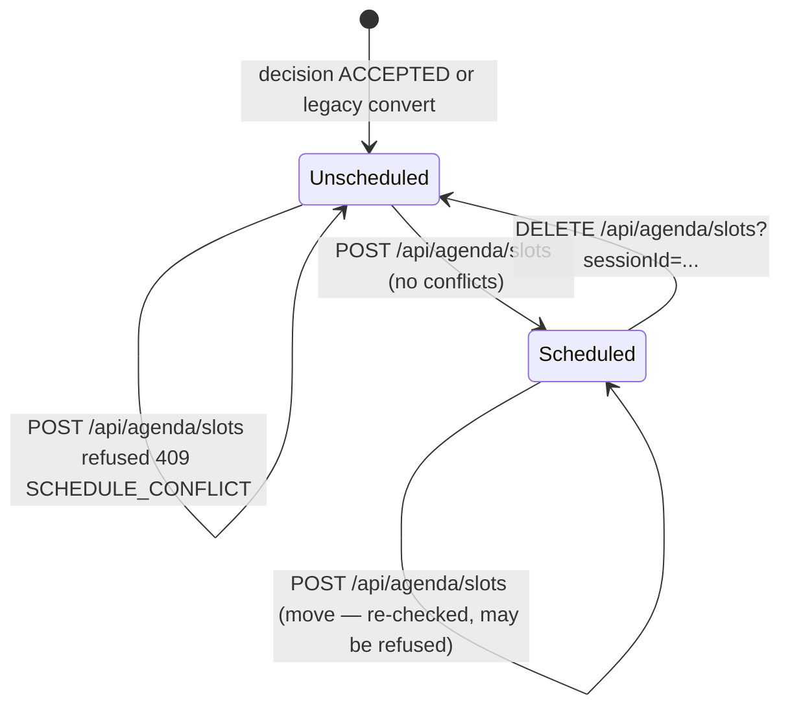
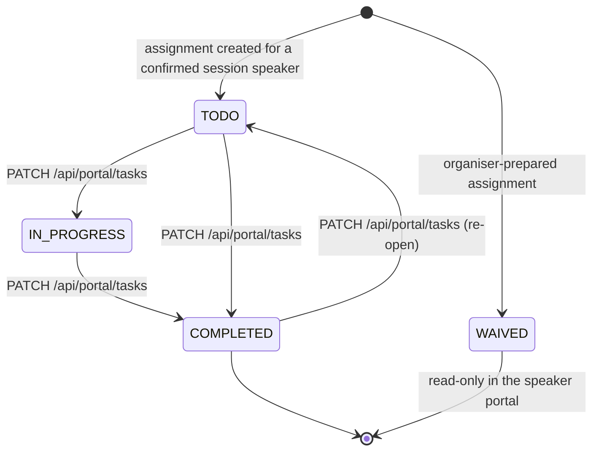

# Lifecycles

The state machines behind the golden path: what each record can be, which route moves it,
and what the server refuses. The transitions below track current `main`; file paths are cited
so a reviewer can check the arrow rather than trust the diagram.

Statuses are Prisma enums in `prisma/schema.prisma` (`AbstractStatus`,
`EvaluationAssignmentStatus`, `TaskStatus`) and mirrored as Zod enums in `types/api.ts`.

---

## Abstract

An `Abstract` is an evaluated CFP proposal. It is never the schedulable record — that is a
`Session` (INV-DOMAIN-001).

```mermaid
stateDiagram-v2
    [*] --> DRAFT: POST /api/cfp/submissions, intent draft
    [*] --> SUBMITTED: POST /api/cfp/submissions, intent submit
    [*] --> SUBMITTED: POST /api/integrations/import
    DRAFT --> SUBMITTED: POST /api/cfp/submissions with abstractId
    DRAFT --> ACCEPTED: POST /api/evaluations/decisions
    DRAFT --> REJECTED: POST /api/evaluations/decisions
    SUBMITTED --> UNDER_REVIEW: POST /api/evaluations/assignments
    SUBMITTED --> ACCEPTED: POST /api/evaluations/decisions
    SUBMITTED --> REJECTED: POST /api/evaluations/decisions
    UNDER_REVIEW --> ACCEPTED: POST /api/evaluations/decisions
    UNDER_REVIEW --> REJECTED: POST /api/evaluations/decisions
    ACCEPTED --> REJECTED: decision reversal
    REJECTED --> ACCEPTED: decision reversal
    SUBMITTED --> MAYBE: POST /api/evaluations/decisions
    UNDER_REVIEW --> MAYBE: POST /api/evaluations/decisions
    MAYBE --> ACCEPTED: POST /api/evaluations/decisions
    MAYBE --> REJECTED: POST /api/evaluations/decisions
    DRAFT --> WITHDRAWN: PATCH /api/cfp/submissions/{id} status WITHDRAWN
    SUBMITTED --> WITHDRAWN: PATCH /api/cfp/submissions/{id} status WITHDRAWN
    UNDER_REVIEW --> WITHDRAWN: PATCH /api/cfp/submissions/{id} status WITHDRAWN
    MAYBE --> WITHDRAWN: PATCH /api/cfp/submissions/{id} status WITHDRAWN
    ACCEPTED --> [*]: decision has provisioned a Session
    WITHDRAWN --> [*]: terminal; no route leaves this state
```

### Transitions

| From | To | Route / file | Notes |
| --- | --- | --- | --- |
| — | `DRAFT` | `POST /api/cfp/submissions`, `app/api/cfp/submissions/route.ts` | `intent: "draft"`. Unauthenticated: the public CFP page posts this. Both public intents require a published, open form. Returns 201. |
| — | `SUBMITTED` | same route, `intent: "submit"` | Runs the full INV-FORM-001 check (published, window, speaker count, required fields, bio length), sets `submittedAt`, and after commit attempts one receipt to the persisted primary submitter when an event template is available. Returns 201. |
| — | `SUBMITTED` | `POST /api/integrations/import`, `app/api/integrations/import/route.ts` | CSV/JSON import creates rows already `SUBMITTED`. Existing rows are only updated when they are `DRAFT` or `SUBMITTED`; anything further along is **skipped**, not overwritten. |
| `DRAFT` | `SUBMITTED` | `POST /api/cfp/submissions` with `abstractId` | The same handler refuses any non-`DRAFT` `abstractId` with `409 ABSTRACT_LOCKED`. That check is what stops an anonymous caller rewriting a submitted proposal, so it is deliberately *not* relaxed for R1. |
| `SUBMITTED` | `UNDER_REVIEW` | `POST /api/evaluations/assignments`, `app/api/evaluations/assignments/route.ts` | Only when the abstract is currently `SUBMITTED`; assigning an already `UNDER_REVIEW`/decided abstract creates the assignment without touching status. Admin only. |
| any except `WITHDRAWN` | `ACCEPTED` or `REJECTED` | `POST /api/evaluations/decisions`, `app/api/evaluations/decisions/route.ts` | Admin only. Sets `decidedAt`; acceptance atomically provisions the Session, roster, and task assignments. `WITHDRAWN` is refused with `409 ABSTRACT_WITHDRAWN`. A decision may be reversed by posting the other decision. |
| any except `WITHDRAWN` | `MAYBE` | same route, `decision: "MAYBE"` | Admin only, and **not** a final decision: `decidedAt` stays null, the proposal keeps being scoreable and re-decidable, and nothing is provisioned. Refused with `409 MAYBE_NOT_AVAILABLE` once a confirmed `Session` exists, because moving a scheduled talk back into review would split public program truth. |
| `DRAFT`, `SUBMITTED`, `UNDER_REVIEW`, `MAYBE` | `WITHDRAWN` | `PATCH /api/cfp/submissions/{abstractId}` with `{ "status": "WITHDRAWN" }` (W1) | The one status transition a **speaker** owns. Status-only: bundling it with any other key is `422`, and `"WITHDRAWN"` is a zod literal so no other status parses. `ACCEPTED` (or any abstract with a `Session`) is refused with `409 WITHDRAW_NOT_ALLOWED` — a confirmed talk is the program team's to remove. Terminal statuses still return `409 ABSTRACT_LOCKED`. `decidedAt` stays null: withdrawing is not a program decision. |

**The portal exposes withdrawal only before a terminal decision.** A speaker can choose **Withdraw
proposal** for a Draft, Submitted, In review, or Maybe abstract and must confirm it first. The
browser sends the existing status-only PATCH; the server still re-checks ownership, status,
and Session presence under the abstract lock. Accepted or Session-linked talks show a contact
the program-team message instead of a dead control.

**Two honest caveats**, both visible in the code:

- The decision route does not require a prior review. An abstract can go straight from
  `SUBMITTED` (or even `DRAFT`) to `ACCEPTED`; evaluation is a workflow, not a gate.
- Declining an accepted abstract does **not** remove the `Session` that acceptance provisioned
  (`app/api/evaluations/decisions/route.ts` deliberately removes nothing) —
  since a scheduled talk must not vanish from the program on a status change
  (INV-DOMAIN-001). Since W2 the decision response carries the linked session
  (`session: { id, title, isScheduled, scheduledAt, roomName } | null`) and `/admin/abstracts`
  shows a **"Still on the program"** warning with a link to the agenda builder
  (`components/abstracts-table.tsx`). Un-programming remains a schedule action: unschedule the
  slot (below).

### Editing rules (R1)

Speakers edit through the session-authenticated routes in
`app/api/cfp/submissions/[abstractId]/route.ts`; the rules themselves live in
`lib/services/speaker-edit.ts` so they are stated once.

| Status | Editable by a speaker on it? |
| --- | --- |
| `DRAFT` | yes — content rules are skipped, exactly like a public draft save |
| `SUBMITTED` | yes |
| `UNDER_REVIEW` | yes |
| `MAYBE` | yes — a shortlisted proposal is still under consideration, so it stays editable |
| `ACCEPTED` | yes — this is the requirement from the competition lead |
| `REJECTED` | no → `409 ABSTRACT_LOCKED` |
| `WITHDRAWN` | no → `409 ABSTRACT_LOCKED` |

The same endpoint carries the one status change a speaker may make — `{"status":
"WITHDRAWN"}`, see the transition table above. Everything below describes content edits.

- **Authorization** is the `AbstractSpeaker` link resolved from the signed session's persisted
  user id (`isAbstractSpeaker`), not the submitter field: any co-speaker may edit. Existence
  and event scope are checked first (`404 ABSTRACT_NOT_FOUND`), then ownership
  (`403 NOT_YOUR_SUBMISSION`), so the route never confirms another event's records.
- **A content edit does not move the abstract through this state machine.** `status`,
  `submittedAt`, `decidedAt`, and `submitterId` are all absent from the update — the only
  exception is the status-only withdraw above, which writes `status` and nothing else.
- **No edit window.** The CFP window gate is skipped on this path
  (`validateSubmissionContent` vs `validateSubmission` in `lib/services/form-validation.ts`) —
  an accepted speaker necessarily edits after the CFP has closed. Public submission to a
  closed form is still refused with `FORM_CLOSED`.
- **The roster locks when a Session exists.** Acceptance normally creates it immediately; if
  the abstract has a `Session`, changing the speaker
  set or who is primary returns `409 SPEAKERS_LOCKED`; content fields stay editable. Resending
  the identical roster is not a change (`rosterChanged` compares lowercased email sets).
- **The linked `Session` is never touched** by an edit (INV-DOMAIN-001). The confirmed record
  keeps the title it had when accepted until an admin changes it.
- Concurrency: the PATCH runs inside a transaction that first takes the per-abstract advisory
  lock (`lib/services/abstract-lock.ts`) and then re-reads status, session, and roster
  membership under that lock. Concurrent co-speaker edits are last-write-wins by design; there
  is no optimistic concurrency token in v1.

### Acceptance and legacy Session backfill

`POST /api/evaluations/decisions` is the normal creation path. On `ACCEPTED`, the locked
transaction creates or reuses the one Session, copies the roster, and idempotently fills the
onboarding-task × speaker assignment cross-product. The response reports the linked Session,
whether it was newly created (`sessionCreated`), and how many assignments were added
(`tasksAssigned`).

`POST /api/evaluations/convert` (`app/api/evaluations/convert/route.ts`), admin only:

- requires `status === "ACCEPTED"`, else `409 NOT_ACCEPTED`;
- creates **at most one** `Session` per abstract — enforced by the unique `sourceAbstractId`
  and by re-checking inside the advisory lock (INV-DOMAIN-001);
- copies the abstract's speakers onto the session as `SessionSpeaker` rows and backfills any
  missing task assignments;
- is idempotent: `201` with a new session, `200` returning the existing `sessionId`. In the
  normal accept-first flow it therefore returns 200.

---

## Session → ScheduleSlot

A `Session` is a confirmed, schedulable talk. It has **at most one** `ScheduleSlot`
(unique `sessionId`); "scheduled" and "unscheduled" are simply whether that row exists.

- **Creation.** Acceptance is the normal way the running app creates a `Session`; the
  conversion endpoint is an idempotent legacy/manual backfill.
- **Direct creation** (guaranteed/sponsor sessions, no source abstract — the seeded opening
  keynote is one). `POST /api/agenda/sessions` (`app/api/agenda/sessions/route.ts`, admin
  only) takes `guaranteedSessionInputSchema` and creates the talk through the same
  `lib/services/session-provisioning.ts` module acceptance uses, so the roster snapshot and
  the onboarding-checklist fan-out (INV-TASK-001) have one implementation. Details:
  - `sourceAbstractId` is `null`, so INV-DOMAIN-001's one-session-per-abstract bound is
    untouched — a talk with no abstract consumes none of it.
  - `contentStatus` is `DRAFT`, overriding the column's `PUBLISHED` default: creating and
    announcing are separate acts, and the existing `PATCH /api/agenda/sessions` is the second.
  - Speakers are **optional** and are named by `userId` from this event's roster
    (`EventMember(role=SPEAKER)` ∪ this event's `SessionSpeaker` rows) — never by email. This
    route mints no `User`; that is `POST /api/admin/speakers`' job under its own C17 identity
    locks. A sponsor slot with no line-up yet is a valid, expected shape.
  - Refusals: `422 VALIDATION_ERROR` for the contract (including a repeated speaker or two
    primaries), `403 EVENT_SCOPE` for a body event id that is not the signed one,
    `404 EVENT_NOT_FOUND`, and `404 SPEAKER_NOT_FOUND` for a user id not on this event's
    roster — the same indistinguishable refusal `/api/admin/speakers` gives, so another
    event's people cannot be enumerated through it.
  - The organizer surface is the "Add session" dialog on `/admin/agenda`
    (`components/new-session-dialog.tsx`); its confirmation names what was created
    (`lib/guaranteed-session-confirmation.ts`), mirroring the acceptance confirmation.
- **Placement.** `POST /api/agenda/slots` (`app/api/agenda/slots/route.ts`, admin only)
  validates that the session, room, and optional track all belong to the caller's event
  (`404 SESSION_NOT_FOUND` / `ROOM_NOT_FOUND` / `TRACK_NOT_FOUND`), then does detection and
  write **inside one transaction** (INV-SCHEDULE-001).
- **Conflict rules** (`detectConflicts`, `lib/services/schedule.ts`): intervals are half-open,
  `[start, end)`, so a talk ending at 10:00 and one starting at 10:00 do not collide. Two
  kinds are reported, and both can fire for one placement:
  - `ROOM_OVERLAP` — the same room is already booked for an overlapping interval;
  - `SPEAKER_OVERLAP` — a speaker on this session is already on stage in that interval.
  A session's own slot is excluded from its comparison, so moving a talk never conflicts with
  itself.
- **Refusal.** Any conflict aborts the write and returns `409 SCHEDULE_CONFLICT` with a
  `conflicts` list the UI renders. `?force=true` records the placement anyway (used only for
  the seeded, deliberate demo conflict).
- **Moving.** The same POST upserts on `sessionId`, so a drag in the agenda day grid
  (`components/agenda-builder.tsx`) is a re-placement that is re-checked server-side; a
  refused drag snaps back. The Week tab is a read-only overview and cannot move anything.
- **Unscheduling.** `DELETE /api/agenda/slots?sessionId=…` removes the slot; the session
  returns to the unscheduled backlog. The session itself is not deleted.
- **Public visibility.** Only placed sessions appear on `/embed/schedule`, in the `.ics`
  export, and in `GET /api/v1/schedule`. The `.ics` entry carries `LOCATION` only when a room
  is assigned (`lib/calendar/ics.ts`).

---

## SpeakerTask

`OnboardingTask` is the event-level **template**; `SpeakerTask` is the per-speaker
**assignment** and is the only place completion is recorded (INV-TASK-001).

- **Creation.** Accepting a proposal (and the legacy convert/backfill path) idempotently assigns
  every event onboarding task to every confirmed session speaker. The deterministic seed does
  the same for its prebuilt program.
- **Updates.** `PATCH /api/portal/tasks` (`app/api/portal/tasks/route.ts`) accepts `TODO`,
  `IN_PROGRESS`, or `COMPLETED`, plus optional `artifactUrl`/`notes` and task-form `responses`.
  It is reversible: `completedAt` is set for `COMPLETED` and cleared otherwise. `WAIVED` may
  exist as an organiser-prepared state, but a speaker cannot set it through this endpoint.
- **Task forms.** Responses merge with the speaker's saved JSON, are pruned to the current
  field set, and reuse the public CFP's conditional/type/option validator. Progress saves may
  be incomplete, but every supplied value must be valid; `COMPLETED` is refused until all
  visible required questions pass. The checklist disables its completion shortcut for a
  form-carrying task, so the speaker opens the form to finish it.
- **Authorization.** `401 UNAUTHORIZED` without a session; `404 NOT_FOUND` when the task is
  not part of the caller's event; `403 NOT_ASSIGNED` when the assignment row is not the
  caller's own. A speaker can only ever move their own row.
- **Derived completion (INV-TASK-001).** Nothing stores "this speaker is done". Both readers
  compute it from the assignment rows, and both count a task as settled when it is `COMPLETED`
  **or** `WAIVED` (`isTaskSettled`, `lib/speakers/status.ts`):
  - `/portal` shows `settled / total` for the signed-in speaker
    (`app/(app)/portal/page.tsx`);
  - `/admin/speakers` aggregates the same rows per speaker, alongside profile completeness
    over the four fields the public program renders, and sorts most-urgent-first
    (`buildSpeakerStatusRows`).
  - Reminder dispatch (`app/api/comms/reminders/route.ts`) selects assignments whose status is
    not in `["COMPLETED", "WAIVED"]` — the same rule, expressed once more.
- `WAIVED` is the "this speaker doesn't need to do this" state: it settles the task without
  claiming it was done, and is displayed but not writable by the speaker portal.

---

## ReviewAssignment (supporting)

Scoring progress lives on `ReviewAssignment` (`EvaluationAssignmentStatus`):
`ASSIGNED` → `IN_PROGRESS` → `COMPLETED`. `POST /api/evaluations/scores`
(`app/api/evaluations/scores/route.ts`) upserts the evaluator's scores and sets the assignment
to `COMPLETED` when the request carries `complete: true`, otherwise `IN_PROGRESS`. Scores must
reference a rubric key in the plan and fall inside that criterion's range (INV-EVAL-001), and
an evaluator can only score abstracts assigned to them (`403 NOT_ASSIGNED`). Since W1 a
withdrawn proposal can appear mid-review, so scoring is refused with `409 ABSTRACT_WITHDRAWN`
— checked before the write **and** re-checked under the shared per-abstract lock
(INV-ABSTRACT-001). Assignment creation takes that same lock and accepts only `SUBMITTED` or
`UNDER_REVIEW`; decided and withdrawn proposals remain visible as historical coverage but
cannot receive new assignments. `DECLINED` exists in the assignment-status enum, but no route
sets it. A withdrawn queue item is archived in the evaluator UI, excluded from active
progress, and never renders a scoring form.
